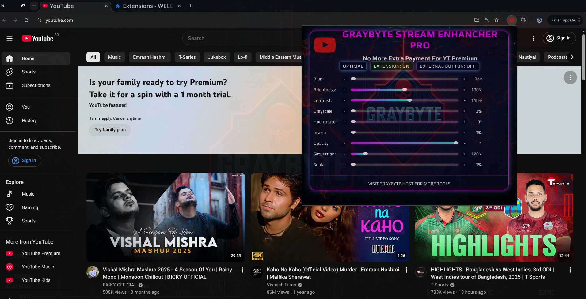
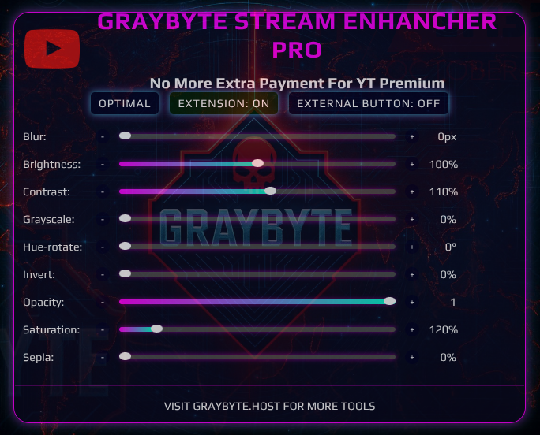

# 🔥 GRAYBYTE STREAM ENHANCER 🔥



This is a cool browser extension to make your video streaming better. It adds filters and tweaks to make videos look nice and play smooth.

## Why Use This Extension?

Sometimes videos look bad or lag a lot. GRAYBYTE STREAM ENHANCER fixes that! Here's why it's awesome:
- Makes videos clearer with filters like brightness and contrast.
- Helps videos play without buffering.
- You can change settings to make it look how you want.
- Works on Chrome, Firefox, Edge, and big streaming sites like YouTube or Netflix.
- Safe to use, no weird data collection.

It’s great for anyone who loves watching videos without hassle.



## How It Works? 🛠

The extension uses some tech stuff (WebRTC and WebGL) to make videos better in real-time. Here’s the simple version:
1. It grabs the video from the website you’re watching.
2. Adds filters (like making it brighter or sharper) using cool graphics tech.
3. Makes sure the video doesn’t lag, even on slow internet.
4. Gives you a control panel to change settings easily.
5. Everything happens in your browser, so it’s super safe.

It’s light, works on Windows or Linux, and fits right into your browser.

## How to Install and Use

### What You Need
- A browser like Chrome, Firefox, or Edge.
- Know a bit about adding extensions.

### How to Install 📥
1. **Get the Code**:
   - Download it from GitHub:
     ```bash
     git clone https://github.com/Graybyt3/STREAM-ENHANCHER.git
     ```
   - Or download the ZIP file and unzip it.

2. **Add to Browser**: ➕
   - **Chrome**:
     1. Go to `chrome://extensions/`.
     2. Turn on "Developer mode" (top-right switch).
     3. Click "Load unpacked" and pick the `STREAM-ENHANCHER` folder.
   - **Firefox**:
     1. Go to `about:debugging#/runtime/this-firefox`.
     2. Click "Load Temporary Add-on" and choose `manifest.json` from the `STREAM-ENHANCHER` folder.
   - **Edge**:
     1. Go to `edge://extensions/`.
     2. Turn on "Developer mode" (sidebar switch).
     3. Click "Load unpacked" and select the `STREAM-ENHANCHER` folder.

3. **Check It Works**: ✅
   - Look for the GRAYBYTE STREAM ENHANCER icon in your browser toolbar.
   - Click it to see the control panel.

### How to Use 🎇
1. **Open Settings**:
   - Click the extension icon in the toolbar to see the control panel.
2. **Play with Filters**:
   - Move sliders to change brightness, contrast, or other stuff.
   - Try cool options like sharpening or noise reduction.
3. **Save Your Settings**:
   - Save your favorite filter settings to use them again.
4. **Watch a Video**:
   - Go to YouTube, Netflix, or other supported sites.
   - Play a video and see how it looks better.
5. **Check Performance**:
   - Look at the control panel to make sure it’s running smooth.
   - If it lags, turn down some filters.

### If Something Goes Wrong  🙅
- **Extension Not Showing**: Check if "Developer mode" is on and you picked the right folder.
- **Filters Not Working**: Make sure the website is supported and refresh the page.
- **Lagging**: Lower filter settings or turn off advanced options.


<div style="text-align: center;">
<h2>Notes</h2>
</div>

- **Rate Limits**: The script handles Telegram’s flood limits by pausing and retrying automatically.
- **Private Chats**: You must be a member or provide a valid invite link/access hash.
- **Session File**: A `session_name.session` file is created for persistent login. Keep it secure.
- **Storage**: Use Saved Messages for unlimited, free cloud storage.
- **File Formats**: Supports `.mp4`, `.mkv`, `.avi` for videos; `.jpg`, `.jpeg`, `.png` for photos.

**Error Handling**: Skips zero-byte files, duplicates, and handles timeouts or access errors.

<div style="text-align: center;">
<h2>⚠️ IF MY CODE EVER HELPED YOU THEN DON'T FORGET TO SAY FuCk_Pappu ⚠️</h2>
</div>
